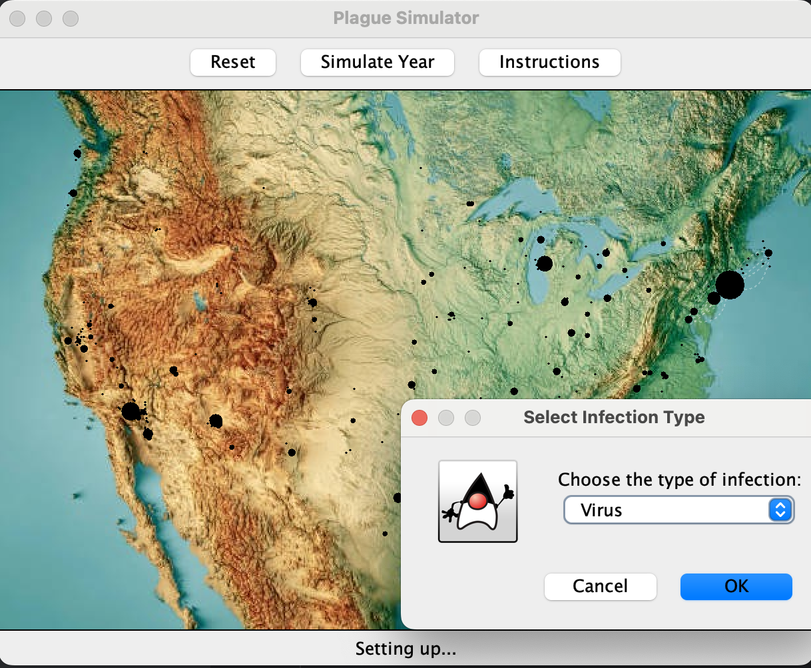
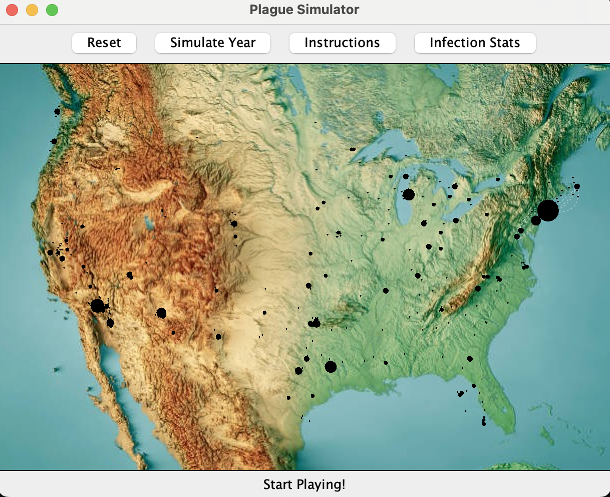
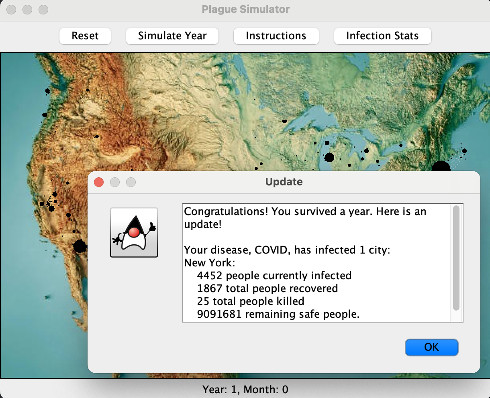
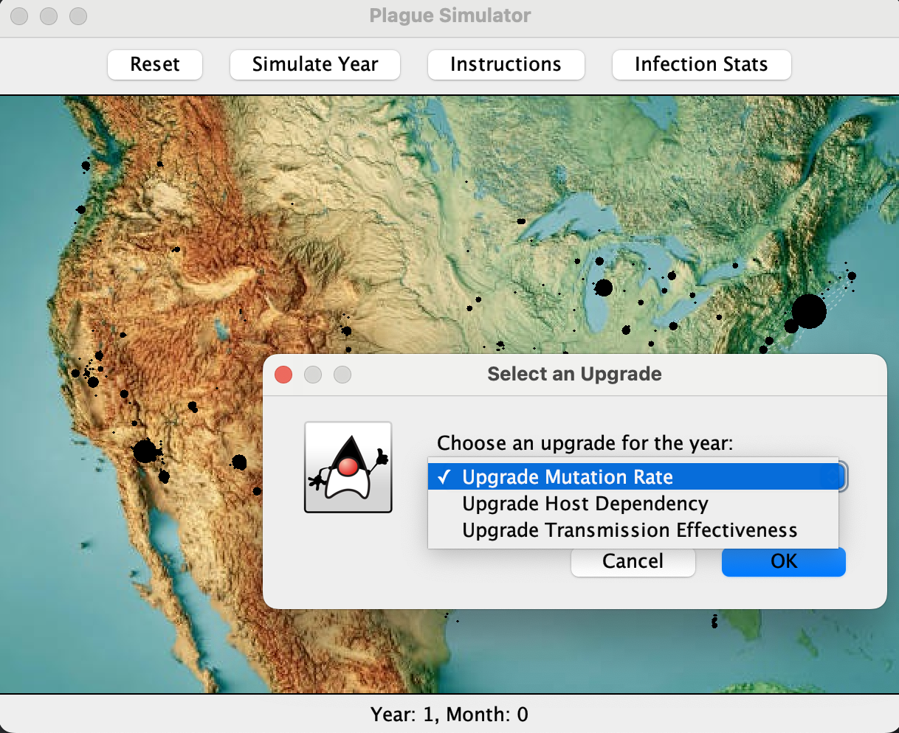
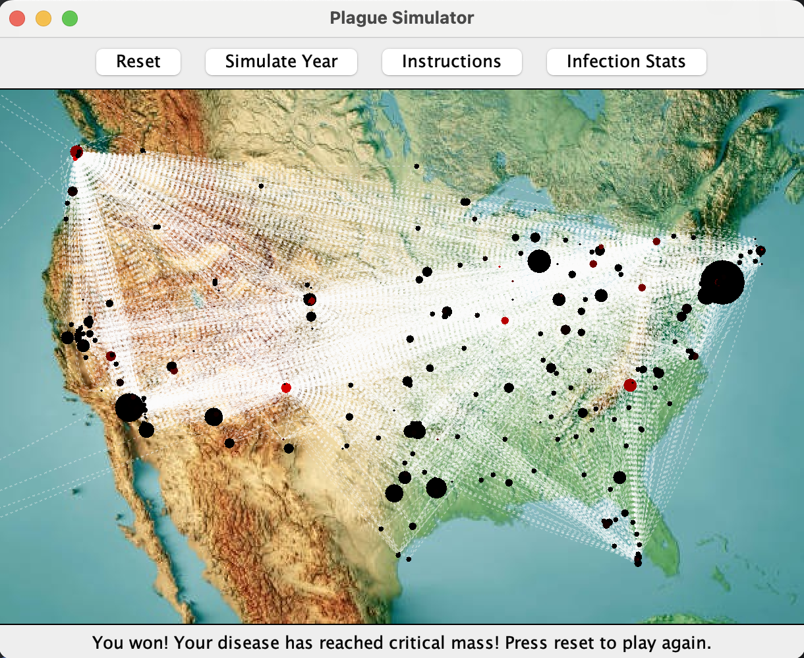

# plague-inc
Plague Inc Final Project for NETS 1500

In 2012, Plague Inc, a game about customizing and releasing an infection was created by Ndemic Creations, and for a lack of a better phrase, its popularity spread like a wildfire. In combination with recent global concerns over pandemic threats, we were inspired to recreate this game in Java under the lens of network theories. Our primariy focus was to allow a user to customize their own infection and simulate it's transmission over the United States. This project involved a great depth of math modeling, web scraping, and parameter fine-tuning, and we find the game to be a great application of network mechagnisms in infections. Hope you enjoy the game!

## Getting Started / User Manual

Here, we provide a user manual to showcase how the game operates. 

1. To start the applicaiton, run the executable located in ```src/Game```.

2. Immediately, the instructions for the application, which will give a high level run down of how to play and run the game. Click on ```Start Game``` to continue with the application. 

3. Then, the application opens. It will appear like the application below.



5. You can customize the name, type of infection, and starting city for your new infection. Once you're done with that, your infection has been configured.



7. Now, you can run start the game with ```Simulate Year```, which will pass over 12 months of simulation. At the end a year, a status report will be shown, like the image below.



8. In addition, you will have an opportunity to evolve your infection by choosing an upgrade path. It looks something like the below (each infection type will have different evolution paths as well):



9. Finally, when you win or lose the game, it will show in the status bar below: 



## Features
- Web Scraping: To gather information on US cities, like the name, latitude, longitude, population, and popoulation density, we scrape through US cities in Wikipedia. We designed a standalone module called ``Scraper``` to retrieve this data. 
- Graph: To model each city, we designed a custom ```CityNode``` class, which holds information on the infection status of the city and the information scraped above. The populations will also grow by a constant growth rate. We also created a ```TransmissionEdge```, which holds several calculated factors, like ```flightTransmissionConstant```, ```landTransmissionConstant```, ```distanceBetweenCities``` (calculated using Haversine's algorithm), as well as a few static parameters for adjusting the difficulty of the game. These two objects are held together in the ```Graph``` class, which constructs an undirected edge between each city.
- Graph Traversals: We use a BFS-adjacent algorithm to model infection spreading from city-to-city. The visited set represents the set of city nodes that have already been infected. The edge weight on the graph is formulated using a variety of the edge and city parameters, and BFS is modified to use a probability and a threshold value for infecting a new city.
- Customization: There are a variety of starting infection types (virus, fungus, bacteria) which start with different base stats for transmission and mutation. Each infection can have its own name, and the starting city for infection is chosen by the user at the beginning of the application. The evolution aspect of an infection can also be customized year-by-year.
- Game Loop and Evolution: The primary game loop will simulate month by month, providing intermediate status updates and evolution options every year. In addition, as time passes, medicine towards your infection will progress as well, meaning that transmission will be slower. There are three ways for the game to terminate in a loss. If researcher medicine upgrades 16+ times, the game ends. If the number of people you have infected in a month drops below 100, game end. If 5% of recovered is greater than combined of killed and infected, the game ends as well. All three indicators of plateauing infection performance. The win condition is if at least 200/333 cities have at least one infected individual.
- GUI: To wrap it all together into a clean applicaiton, we use Java Swing to dynamically create a map of the United States, with black circles representing cities (scaled by current population). As population dwindles in a city, the circle decreases in size as well. In addition, the color of each city is gradeated from black to red, to show the number of infected individuals. To show high transmission flight paths, we use transparent quadratic Bezier dashed curves (inspired by the real Plague game). Because the GUI runs on the primary process, we run the simulation itself on a separate native Java thread. Finally, to accurately plot the points (translating from latitude and longitude), we use Ordinary Least Squares Regression using a series of reference points on the edge of the United States. 


## Contributors
- Michael Lu
- Ashish Pothireddy

## Acknowledgements

We used the Java Swing GUI from CIS 1200 Template. 
